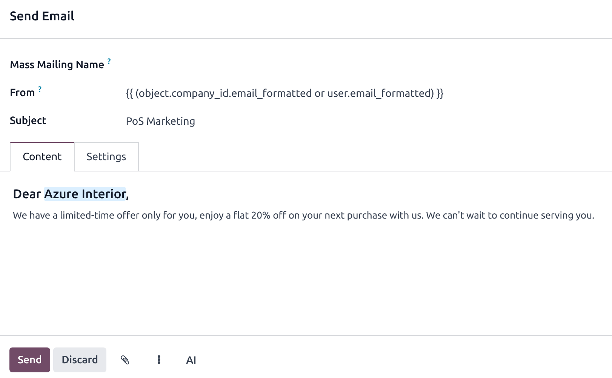
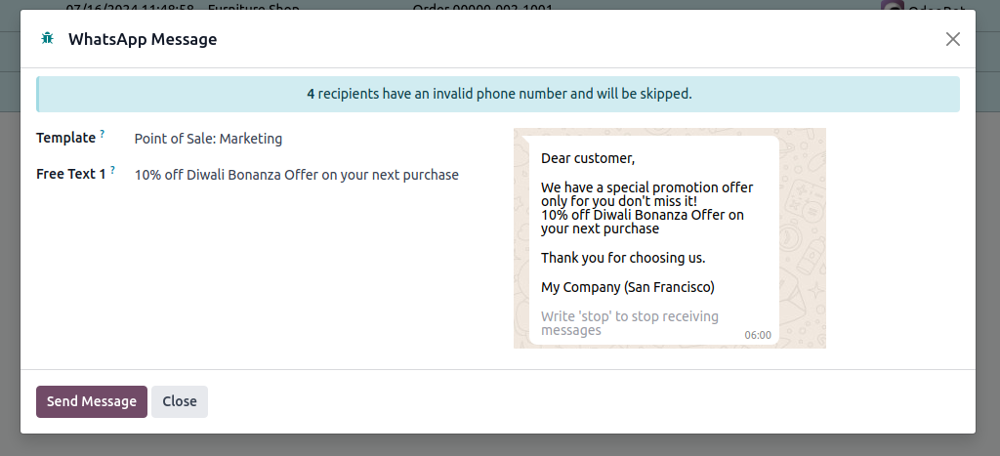
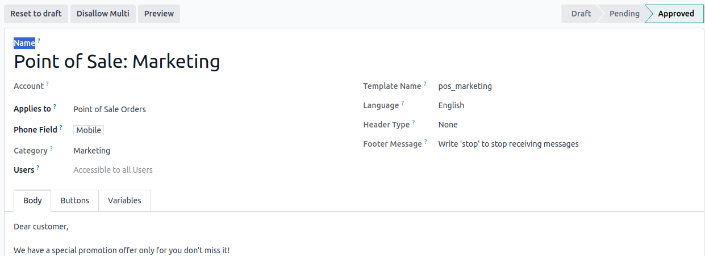

==================
Marketing features
==================

You can use the POS to reach your customers by sending them promotional offers by email or by
WhatsApp.

Storing contact details
=======================

This feature requires your customer's contact details, either their email address or phone number.

Email addresses are automatically collected and save in POS orders when sending a receipt by email.

However, you must enable :menuselection:`Configuration --> Settings --> WhatsApp Enabled` or
:menuselection:`Configuration --> Settings --> SMS Enabled` in the :guilabel:`Bills & Receipts`
section to store phone numbers when sending receipts on WhatsApp or by SMS.

.. image:: pos_based_marketing/sms-whatsapp-enabled.png
   :alt: setting to enable to store phone numbers when sending receipts

Now, if you do not have a customer's contact information, it is automatically saved in POS orders
after sending the receipt via email, SMS, or WhatsApp.

Emails
======

To send marketing emails to your customers from POS orders,

#. Go to :menuselection:`Point of Sale --> Orders --> Orders`;
#. Select the orders;
#. Click :guilabel:`Actions` and :guilabel:`Send Email` from the dropdown menu.

Doing so opens an email composing form. Fill it in and hit :guilabel:`Send`.

.. tip::
   - Save some time and save your content as a template. Click the vertical elyspis button and
     select your template under the :guilabel:`Insert Template` section.
   - You can also save your content as template for later purposes. Click the vertical elyspis
     button, and select :guilabel:`Save as Template`.

.. note::
   - Fill in the :guilabel:`Mass Mailing Name` field to create a mass mailing and track its results
     in the :doc:`Email Marketing app <../../marketing/email_marketing>`.
   - If no partner with the same email is found, a new partner will be created.

.. seealso::
   :doc:`Use the email marketing app for more advanced marketing features
   <../../marketing/email_marketing>`.

Whatsapp messages
=================

To send WhatsApp marketing messages from the POS using the phone numbers collected in POS orders,
you first need to enable the related server action. To do so,

 #.  Get marketing templates approved with the :guilabel:`Applies to` field set to
     :guilabel:`Point of Sale Orders`, and the :guilabel:`Phone Field` set to either
     :guilabel:`mobile` or :menuselection:`Partner --> Mobile`.
 #.  Click the :guilabel:`Allow Multi` button to create a server action in the POS orders list view.

.. seealso::
   :doc:`WhatsApp configuration <../../productivity/whatsapp>`

Then,

#. Go to :menuselection:`Point of Sale --> Orders --> Orders`;
#. Select the orders;
#. Click :guilabel:`Actions` and :guilabel:`WhatsApp Message` from the dropdown menu.

Doing so opens an WhatsApp message composing form. Fill it in and hit :guilabel:`Send`.

-  Select the desired marketing template for the message.
-  Click the :guilabel:`Send Message` button.

.. note::
   - You can send marketing templates only from the POS order's :guilabel:`Send WhatsApp` server
     action.
   - Approved marketing templates with the allow multi option enabled and
     :guilabel:`Point of Sale Orders,` in the "applies to" field
     are required for WhatsApp marketing in the Point of Sale.

.. seealso::
   :doc:`../../productivity/whatsapp`
