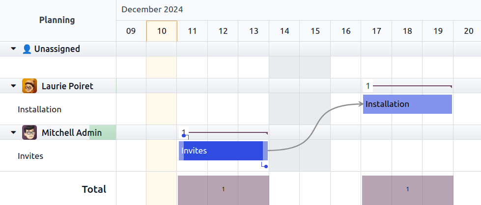

=================
Task dependencies
=================

Odoo Project allows you to split your projects into tasks and assign priorities among them. The
relationships established between tasks ensure that specific tasks cannot start until others are
completed.

Configuration
=============

To enable task dependencies in Projects, go to :menuselection:`Project --> Configuration -->
Settings`, enable :guilabel:`Task Dependencies`, and Click the :icon:`fa-cloud-upload`
(:guilabel:`save`) icon.

Set task dependencies
=====================

- In a project, open a task.
- Click the :guilabel:`Blocked by` tab.
- Click :guilabel:`Add a line`, and check the box for the tasks that need to be completed before
  this task can start.

.. note::
   - **Predecessor**: The task that is blocking another task.
   - **Successor**: The task that is blocked by another task.

Odoo automatically manages task progress based on their dependency: the status of a successor cannot
be changed to **In Progress** until its predecessor status is marked as **Approved**, **Cancelled**,
or **Done**. The predecessor displays a **Blocked Tasks** Smart Button and the status of a successor
is set to **Waiting**.

Task dependencies in gantt view
===============================

The Gantt view allows you to visualize how tasks are related on a timeline grid. To enter Gantt
view, go to your project and click the :icon:`fa-tasks` (:guilabel:`gantt view`) icon at the top
right of the screen.

Create a dependency in gantt view by hovering your mouse over a task. Click and drag one of the dots
that appear, then drop it onto another task. The task at the start of the arrow is the predecessor
and the one at the end of the arrow is the successor.

Remove dependencies
===================

- From the task form: go to the **Blocked by** tab and click the :icon:`fa-times` button.
- From Gantt view: click the red :guilabel:`X` button that appears at the center of the arrow when
  you hover your mouse over it.
